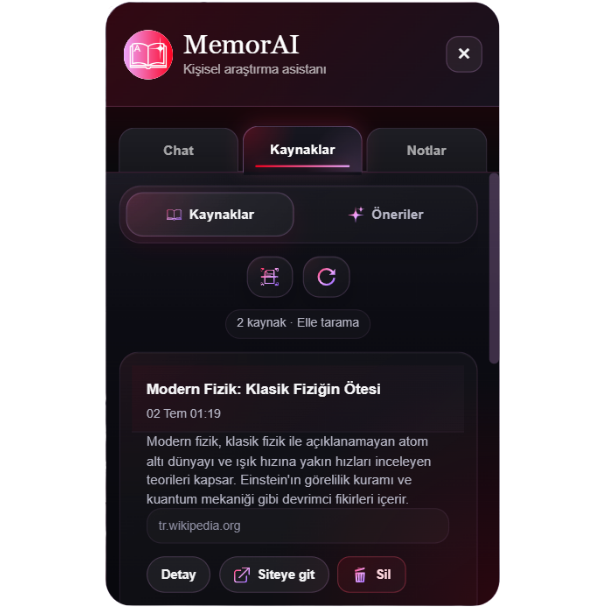
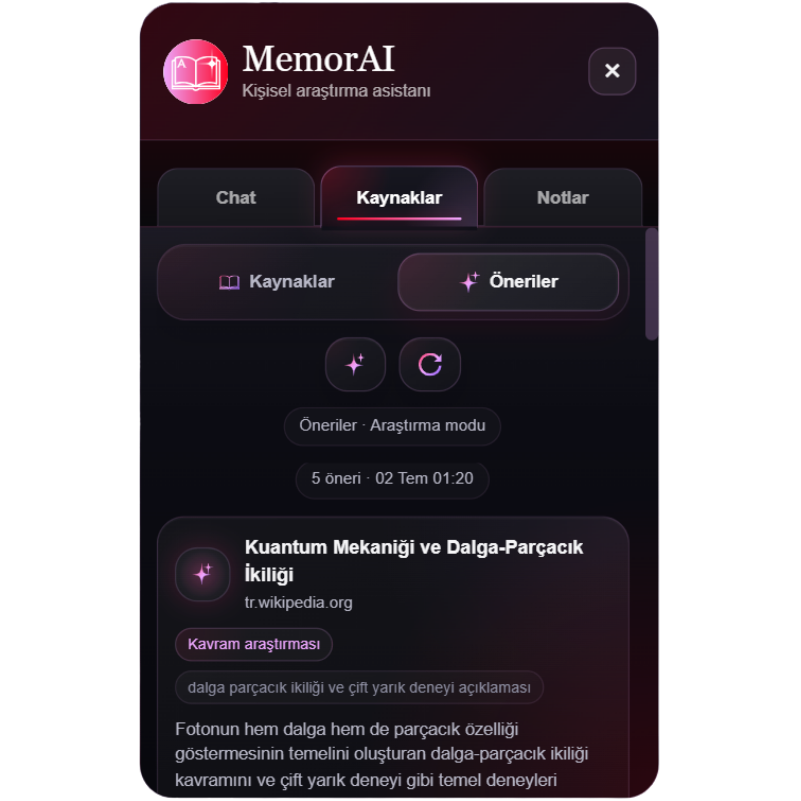
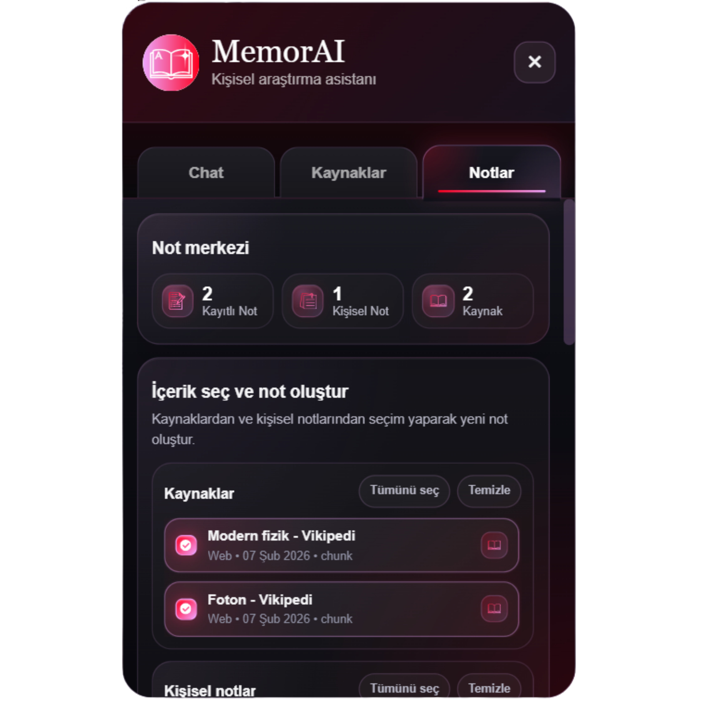

<div align="center">

# MemorAI

### Adaptive RAG Chrome Extension

Web araştırmalarını kalıcı, aranabilir ve kaynak destekli bir kişisel bilgi hafızasına dönüştüren Chrome eklentisi.

</div>

---

## Proje Hakkında

**MemorAI**, ziyaret edilen web sayfalarını tarayan, temizleyen ve semantik parçalara ayırarak vektör hafızasına kaydeden yapay zeka destekli bir araştırma asistanıdır.

Kullanıcı chat ekranından soru sorduğunda sistem, en ilgili içerik parçalarını FAISS üzerinden bulur ve LLM'e bağlam olarak göndererek kaynak destekli cevap üretir.

MemorAI yalnızca soru-cevap sunmaz; taranan kaynakları yönetir, yeni kaynak önerileri üretir, kişisel notları saklar ve doğal dil komutlarıyla düzenli araştırma notları oluşturur.

---

## Uygulama Görselleri

<table>
  <tr>
    <td align="center">
      
      <br>
      <strong>Chat</strong>
    </td>
    <td align="center">
      
      <br>
      <strong>Kaynaklar</strong>
    </td>
  </tr>
  <tr>
    <td align="center">
      
      <br>
      <strong>Öneriler</strong>
    </td>
    <td align="center">
      
      <br>
      <strong>Notlar</strong>
    </td>
  </tr>
</table>

---

## Temel Özellikler

- Web sayfalarından içerik çıkarma ve temizleme
- Cümle embedding'lerine dayalı semantik chunking
- FAISS tabanlı vektör arama
- Kaynak destekli RAG chat
- Kaynak ve chunk yönetimi
- Cevabın geçtiği bölümü sayfada gösterme
- Mevcut kaynaklara göre araştırma önerileri
- Web search destekli kaynak keşfi
- Kişisel not oluşturma ve semantik hafızaya ekleme
- Doğal dil ile araştırma notu, ders notu ve özet oluşturma

---

## Sistem Mimarisi

```text
Web Sayfası
    │
    ▼
Content Extraction
    │
    ▼
DOM Cleaning
    │
    ▼
Semantic Chunking
    │
    ▼
Embedding Generation
    │
    ▼
FAISS Vector Store
    │
    ▼
Retriever
    │
    ▼
RAG / Agents / LLM
    │
    ▼
Chat · Kaynaklar · Öneriler · Notlar
```

---

## Proje Yapısı

```text
adaptive-rag-project/
│
├── backend/
│   ├── agents/
│   ├── core/
│   │   └── chat/
│   ├── prompts/
│   ├── routes/
│   ├── services/
│   │   └── research/
│   ├── app.py
│   └── requirements.txt
│
├── extension/
│   └── rag-extension/
│       ├── assets/
│       ├── core/
│       ├── icons/
│       ├── scraping/
│       ├── ui/
│       │   └── widget/
│       │       ├── events/
│       │       ├── render/
│       │       └── styles/
│       ├── utils/
│       └── manifest.json
│
└── README.md
```

---

## Kullanılan Teknolojiler

### Backend

- Python
- FastAPI
- FAISS
- NumPy
- Sentence Transformers
- Gemini API

### Extension

- Chrome Extension Manifest V3
- JavaScript
- HTML
- CSS
- Chrome Runtime Messaging
- Chrome Storage API

### Yapay Zeka

- Retrieval-Augmented Generation
- Semantic Search
- Semantic Chunking
- Intent Detection
- Agent tabanlı not üretimi
- Web search destekli araştırma

---

## Kurulum

### Backend

```bash
cd backend

python -m venv venv
venv\Scripts\activate

pip install -r requirements.txt
```

`backend/.env` dosyasına API anahtarını ekle:

```env
GEMINI_API_KEY=your_api_key
```

Backend'i başlat:

```bash
uvicorn app:app --reload --host 127.0.0.1 --port 8000
```

### Chrome Eklentisi

1. Chrome'da `chrome://extensions` sayfasını aç.
2. Geliştirici modunu etkinleştir.
3. **Paketlenmemiş öğe yükle** seçeneğine tıkla.
4. `extension/rag-extension` klasörünü seç.
5. Backend çalışırken MemorAI widget'ını aç.

---

## Kullanım Örnekleri

```text
Bu sayfadaki en önemli nokta nedir?

Bu bilgiyi nereden aldın?

Bu konuyla ilgili yeni kaynaklar öner.

Bu kaynaklardan bana araştırma notu oluştur.
```

---

## Teknik Not

FAISS vector store şu anda backend belleğinde çalışmaktadır. Backend yeniden başlatıldığında vektör kayıtları temizlenebilir.

---

<div align="center">

**MemorAI, web üzerinde yapılan araştırmaları hatırlanabilir ve yeniden kullanılabilir bir bilgi hafızasına dönüştürür.**

</div>
